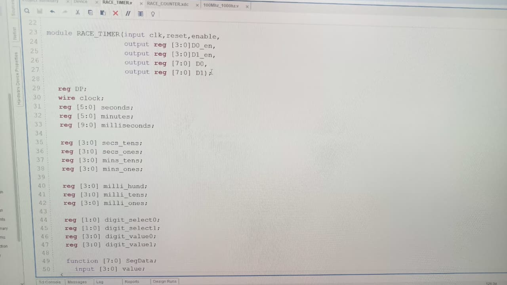
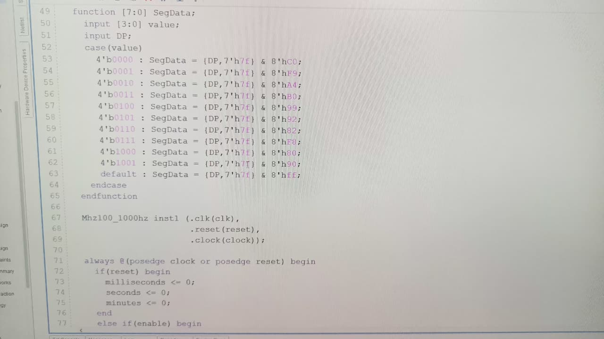
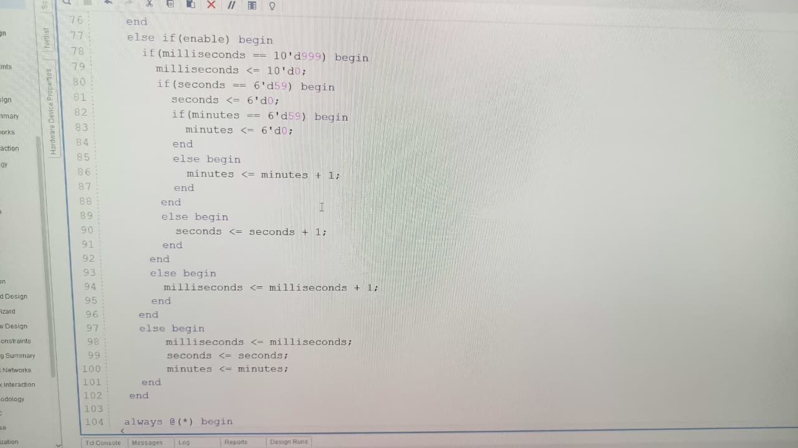
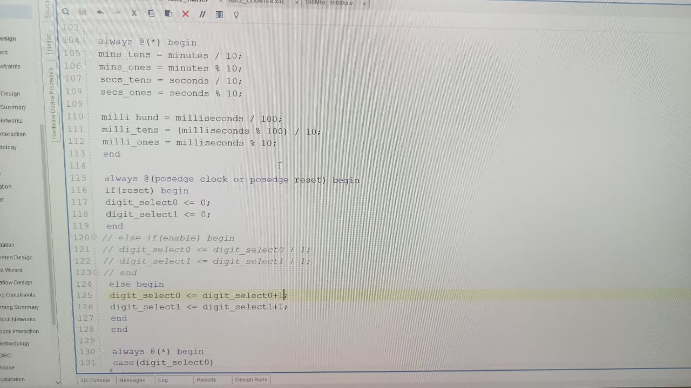
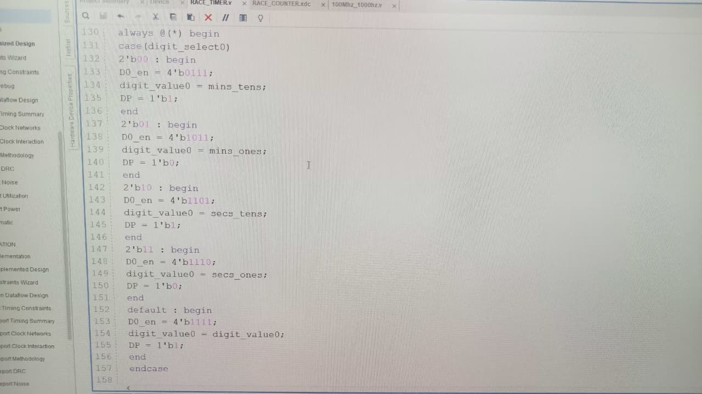
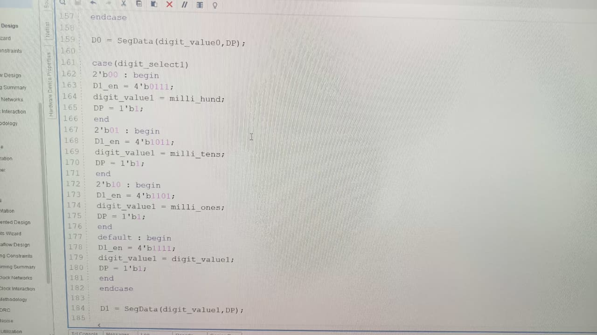
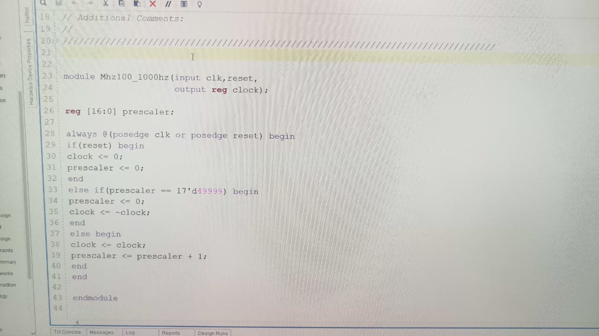
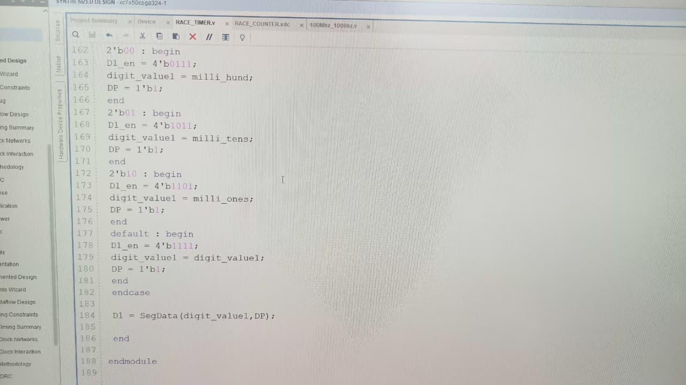
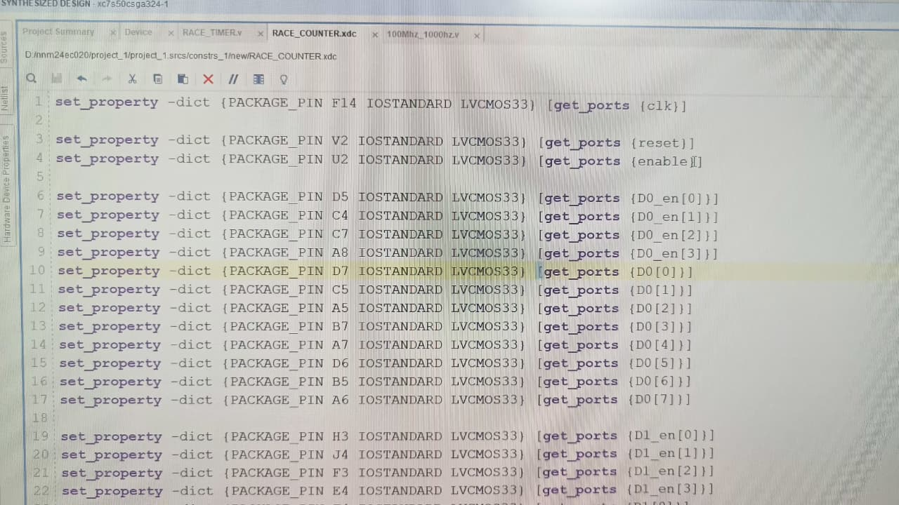
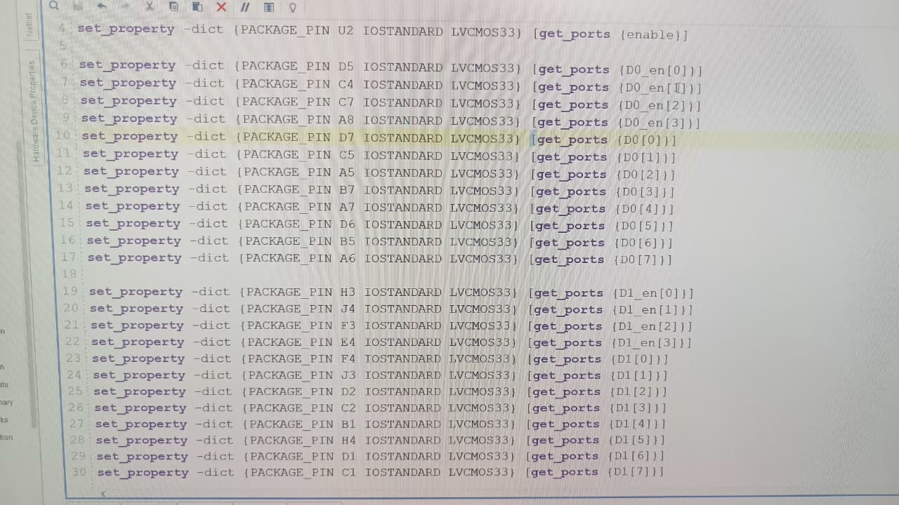

# 🏁 FPGA Race Timer — Real-Time Stopwatch on Hardware  

**Developed using Verilog and AMD Vivado | NMAM Institute of Technology (ECE Lab Project)**  

---

## 🧩 Project Overview  

This project implements a **real-time race timer** entirely in hardware on the **Real Digital Boolean Board (Spartan-7 XC7S50 FPGA)** using **Verilog HDL** and **Vivado**.  
The system tracks **minutes, seconds, and milliseconds**, and displays them in real time using multiplexed **7-segment displays**.

💡 The goal was to design a digital race timer that runs with hardware-level accuracy, demonstrating concepts like:
- Clock division  
- Hardware counters  
- Timing synchronization  
- Real-time output control  

---

## ⚙️ Features  

✅ Precise time tracking up to milliseconds  
✅ Hardware-level counters written in Verilog  
✅ Custom clock divider (100 MHz ➜ 1 kHz)  
✅ Seven-segment multiplexed display interface  
✅ Reset and enable control inputs for live testing  
✅ Implemented, synthesized, and tested on AMD FPGA  

---

## 🧠 Concept Flow  

1. **Clock Input (100 MHz)** → divided to 1 kHz  
2. **Counter Logic** → counts milliseconds → seconds → minutes  
3. **Display Logic** → converts binary values to 7-segment display format  
4. **Enable / Reset** → used to start, stop, and reset the timer  

---

## 🧰 Tools & Technologies  

| Tool | Purpose |
|------|----------|
| **Vivado Design Suite** | HDL Simulation, Synthesis, Bitstream Generation |
| **Verilog HDL** | Design Implementation Language |
| **Real Digital Boolean Board (Spartan-7 XC7S50 FPGA)** | Target Hardware |
| **7-Segment Displays, LEDs, Switches** | Output Interface |

---

## 📸 Code Walkthrough  

Below are snippets of the Verilog implementation and constraints that make up the full race timer design.  
Each section represents a part of the logic hierarchy.

---

### 🧮 **1️⃣ Module Declaration & Registers**

This section defines the input/output ports, timing registers, and display control variables.

---

### 🔢 **2️⃣ 7-Segment Display Function**

Implements a `SegData` function that converts a 4-bit value into an 8-bit 7-segment pattern (for digits 0-9).

---

### ⏱️ **3️⃣ Clock Divider Instantiation**

This module converts the board’s 100 MHz clock into a 1 kHz timing pulse used to increment the millisecond counter.

---

### 🧮 **4️⃣ Core Counter Logic**

Implements nested conditional logic that increments milliseconds, seconds, and minutes — resetting when limits are reached.

---

### 🔄 **5️⃣ Hierarchical Time Update**

Handles time overflow conditions and ensures synchronization between millisecond and second counters.

---

### 🔢 **6️⃣ Binary-to-Digit Conversion**

Breaks down millisecond, second, and minute counters into individual digits for display (hundreds, tens, ones).

---

### 💡 **7️⃣ Display Multiplexing**

Alternates through digit selections rapidly to create the illusion of a continuous display on the 7-segment modules.

---

### 🧱 **8️⃣ Output Encoder**

Selects which digit’s value to send to the display based on the active segment position.

---

### 🧩 **9️⃣ Pin Assignments (.xdc)**

Defines FPGA pin mappings for each input, output, and 7-segment display.  
This ensures the Verilog signals correspond to the physical hardware pins on the Boolean Board.

---

### ⚙️ **🔟 Clock Divider Submodule**

Implements a precise prescaler using an always block to toggle the clock every 50,000 cycles of the 100 MHz input, generating a 1 kHz timing signal.

---

## 🎥 Demo Video  

🎬 Watch the live working demo here:  
➡️ [Watch on LinkedIn] https://www.linkedin.com/feed/update/urn:li:ugcPost:7392545040939778048/

*(The local `racetimer.mp4` file exceeds GitHub’s preview size limit, so it’s hosted externally.)*  

---

## 🧩 Learning Outcomes  

Through this project, I gained hands-on experience in:  
- Designing **modular Verilog architectures**  
- Using **clock management** and timing constraints in Vivado  
- Implementing **hardware counters and multiplexers**  
- Debugging FPGA behavior using on-board LEDs and simulation tools  

---

## 🏗️ Future Improvements  

🔹 Add lap-time memory and recall functionality  
🔹 Implement start/stop control through push buttons  
🔹 Extend to multi-lane race tracking using parallel logic  

---

## 👨‍💻 Developer  

**Arya Dinesh**  
B.Tech in Electronics and Communication Engineering  
NMAM Institute of Technology, Nitte  

📫 *Let’s connect:* [LinkedIn Profile] www.linkedin.com/in/aryadinesh2005 

---

⭐ *If you found this project interesting, feel free to star this repository!*  
🧠 *Open for collaboration or discussion on FPGA, digital design, and embedded systems.*

---

